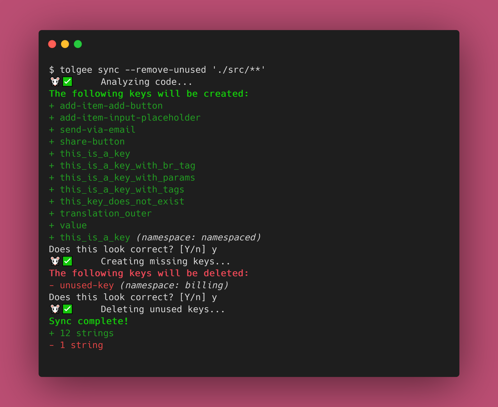

# Tolgee Flutter SDK 🐁

A multiplatform Flutter SDK for the Tolgee localization platform.

The SDK is currently in beta. We're working on adding more features and improving the existing ones. If you have any
suggestions, feel free to open an issue or a pull request!



## Installation
The Tolgee CLI is published as a NPM package. You simply need to install it, and you're good to go!

```sh
# npm
npm i --global @tolgee/cli

# Yarn
yarn global add @tolgee/cli

# pnpm
pnpm add --global @tolgee/cli
```

See our [documentation](https://tolgee.io/tolgee-cli/installation) for more information.

## Usage
Once installed, you'll have access to the `tolgee` command. Run `tolgee help` to see all the supported commands, their
options and arguments.

Make sure to give the [docs](https://tolgee.io/tolgee-cli/usage) a look!

## Contributing
Contributions are welcome!

----
🧀
